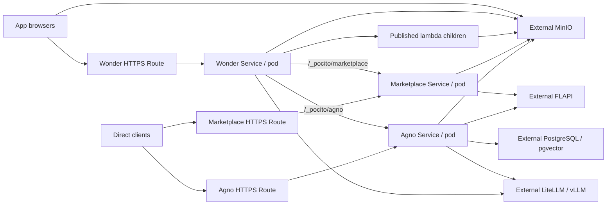

# Pocito production architecture

Revision 4 · 2026-09-09 · Customer-managed ConfigMaps; shared runtime changes remain reverted.

Deploy Wonder/Pocito, Marketplace, and Agno as three services on the customer's air-gapped OpenShift cluster.
Wonder serves published applets, runs published lambdas, and proxies application requests to Marketplace, Agno, and LiteLLM.
Marketplace and Agno also have direct HTTPS routes. Authentication design, preparation, and implementation are outside this work.

**Confirmed decisions**

| Item | Decision |
| --- | --- |
| O1 | Browsers reach MinIO directly. No storage proxy. |
| O2 | Persist Agno conversations in external PostgreSQL, supplied through environment variables. |
| O3 | Three pods total: one per service. Scaling is deferred. |
| O4 | Three customer DNS names; edge TLS termination at OpenShift ingress, HTTP to the Services. |
| O5 | Application authentication stays disabled. No preparation for authentication. |

**Server responsibilities**

| Capability | Pocito dev / shared local server | Wonder cloud server | Pocito production |
| --- | --- | --- | --- |
| Applets/lambdas | Repository development execution | Published runtime | Published runtime backed by MinIO |
| Development APIs | Upload, development MCP, source/CLI tools | Cloud runtime entry point | Excluded |
| Marketplace/Agno | Gateway and locally launched processes | Separate from cloud entry point | Separate services, gateway and direct routes |
| Models | LiteLLM | Cloud integration | Customer LiteLLM/vLLM |
| Assets | Local repository and storage | Cloud storage/CDN | MinIO and mirrored runtime assets |

Compose existing shared production handlers; keep the dev and cloud entry points separate.
Move the gateway out of `dev/` so dev and production reuse it.
The shared lambda handler, both jb6 CLI files, and the shared on-prem LLM proxy are restored to their original code.

**Runtime scope under review**

Goal: deploy the existing Wonder execution behavior with Pocito configuration, without modifying shared runtime or jb6 core.

| Alternative | Simplicity (1–5) | Cloud behavior parity (1–5) | Core unchanged |
| --- | ---: | ---: | --- |
| Reuse existing handlers and deployment configuration | 5 | 5 | Yes |
| Add only demonstrated Pocito request/context adaptations at its entry point | 4 | 4 | Yes |
| Build a Pocito-owned lambda executor | 2 | 2 | Yes |

Recommend existing handlers, with local adaptations only for reproduced integration failures. No replacement executor is implemented.
The existing serverTimeout stops waiting but does not terminate execution; disconnect also does not cancel the child.
SSE subscribes to a process-wide progress emitter. Progress delivery and concurrent request isolation need validation against this original runtime.
Hard cancellation and a replacement progress transport are separate runtime work, not prerequisites for matching the cloud server.
Ordinary HTTP timeout middleware cannot guarantee child termination or isolate events from a shared emitter.
Nested no-auth callbacks may need noAuth in the incoming packed context; any required adaptation belongs in the Pocito entry point.

**Packaging**

Scores describe suitability for this installation; 5 is best.

| Alternative | Simple installation | Independent release history | Simple maintenance |
| --- | ---: | ---: | ---: |
| One Helm chart with three Deployments | 5 | 3 | 5 |
| Parent chart with three subcharts | 4 | 3 | 3 |
| Three charts and releases | 2 | 5 | 3 |

Use one chart, with independent image settings and existing ConfigMap/Secret references per service, and one upgrade/rollback history.
Use `Recreate` updates to avoid a fourth pod; updating a service briefly interrupts it. No HPA or replication work.
The chart provides three Deployments, ClusterIP Services and OpenShift Routes, with resource settings and health probes.
The customer creates and edits the ConfigMaps; Helm references them without generating or overriding their values.
ConfigMaps and optional Secrets provide runtime settings through envFrom. External MinIO, PostgreSQL, LiteLLM/vLLM, and FLAPI remain customer-managed.

**Networking**

| Browser/direct URL | Upstream |
| --- | --- |
| `https://pocito.<domain>/room/<room>/applet/<name>` | Wonder published applet host |
| `https://pocito.<domain>/_pocito/marketplace/...` | Marketplace Service, port 7777 |
| `https://pocito.<domain>/_pocito/agno/...` | Agno Service, port 7778 |
| `https://pocito.<domain>/llmProxy` | Customer LiteLLM |
| `https://marketplace.<domain>/...` | Marketplace directly |
| `https://agno.<domain>/...` | Agno directly, including `/mcp` |

The gateway removes its prefix and streams multipart uploads, binary downloads, and model/agent responses.
Redirects and API documentation work through both paths. Room/model headers retain their existing meaning.
Applets receive relative gateway URLs. Pods use Service DNS between these workloads and customer-network addresses for external dependencies.
`WONDER_SERVICE_URL` routes lambda callbacks to Wonder. Use the deployed hostname for published execution.
The original lambda handler treats `localhost` as live-repository execution; the reverted publishedOnly override is no longer available.

Use customer DNS names covered by the OpenShift ingress certificate, with HTTP-to-HTTPS redirects.
The cluster administrator owns ingress certificates. Pods listen on unprivileged HTTP ports.
Route idle timeout starts at a configurable 300 seconds. Configure corporate DNS, firewall/NAT access and outbound CA trust.

**Environment and state**

Runtime keys are written directly into customer-managed ConfigMaps or Secrets, not Helm env values.
The chart does not derive service URLs, model settings, database URLs, CORS origins or certificate variables.
See prod/README.md for the per-service keys and service-address examples. Restart the consuming Deployment after editing its configuration.

| Variable | Purpose |
| --- | --- |
| `MINIO_ENDPOINT` | MinIO address reachable by pods and browsers |
| `WONDER_STORAGE_URL` | Optional browser address override; defaults to `MINIO_ENDPOINT` |
| `WONDER_CDN_URL` | Browser-accessible directory containing mirrored React/runtime assets |
| `MINIO_ACCESS_KEY`, `MINIO_SECRET_KEY`, `MARKETPLACE_S3_BUCKET` | Existing Marketplace storage configuration |
| `AGNO_DB_URL` | SQLAlchemy PostgreSQL URL for persistent Agno sessions |
| `PGVECTOR_URL` | PostgreSQL/pgvector URL; may refer to the same database |
| `LITELLM_HOST`, `OPENAI_MODEL`, `OPENAI_EMBEDDING_DIMENSIONS` | Model server and model configuration |
| `FLAPI_BASE_URL` | External FLAPI address |

Agno sessions retain room separation and survive process replacement. The supplied database user needs schema/table creation permissions.
Marketplace records, artifacts, and ingestion jobs stay in MinIO; embeddings stay in pgvector.
Extracted lambdas and materialized agent content use disposable `emptyDir` storage. Pods do not share a filesystem.
Agno's ingestion loop stays within Agno. Session persistence does not automatically resume interrupted runs.

**Runtime and offline delivery**

Build three images with locked dependencies before entering the air gap; include the required document readers.
DuckDB and lambdas requiring it are outside this release.
Startup installs nothing and downloads no dependencies. Publish applets, lambda packages, and mirrored browser assets to MinIO separately.
Images support OpenShift-assigned UIDs, writable temporary directories, and read-only root filesystems.
Liveness checks the process; readiness reports required dependency failures with a failing HTTP status.
Wonder remains ready when an optional upstream is down. Shutdown stops accepting requests and closes connections after its configured deadline.
Lambda execution, timeout and progress behavior remain those of the existing shared handler. There is no added per-request child cancellation.

Release tooling builds/saves the three images, packages the chart, and records checksums for offline transfer.
Load/push images into the customer's registry, populate ConfigMaps/Secrets, and supply their names with images and Route hosts in Helm values.
Publish immutable content before changing applet/lambda definitions. Retain older artifacts for rollback.
Helm rollback restores workloads; customer ConfigMaps, Secrets, MinIO content and PostgreSQL state remain independently managed.

**Implementation sequence**

1. Add the production Wonder app/listener and share the gateway, preserving dev behavior.
2. Wire PostgreSQL sessions, direct/gateway paths and probes; reuse the original lambda runtime.
3. Add three image targets and offline build/export tooling.
4. Add the Helm chart and documented customer values contract.
5. Verify published execution, real storage/PostgreSQL persistence, gateway/direct APIs, chart rendering, and container startup.

Production code/tooling lives in `solutions/pocito/on-prem/prod/`; the chart lives in `solutions/pocito/on-prem/helm/pocito/`.
Validation uses real dependencies. Customer OpenShift Route/certificate/firewall checks require access to that cluster.

**Implementation review**

The Wonder entry point composes existing handlers; both entry points now share the same gateway.
Both Python services share one small HTTP helper. The image layout follows the existing published-lambda loader contract.
The chart uses one template for all three services. No authentication preparation or scaling machinery was added.
The previous runtime verification and exported images predate this revert. Revalidate the baseline and rebuild before deployment.
The existing pocitoProd.runtime test still asserts the removed behavior; retain it as diagnostic coverage pending this design decision.

New naming review: 5 means clear in this context; 4 means a concise local name whose enclosing scope supplies its meaning.

| Names | Score | Meaning |
| --- | ---: | --- |
| createPocitoProdApp, SHUTDOWN_TIMEOUT_MS | 5 | Production composition and HTTP shutdown deadline |
| AGNO_DB_URL, session_url, session_db_engine, room_db, schema | 5 | Persistent sessions and their room-specific schema |
| stopping, session_store | 5 | Worker shutdown and session database health |
| setup_service_http, ready, health, assets, API_DOCS_DIR | 5 | Shared probes and local API documentation |
| public_endpoint | 5 | Browser endpoint used when signing object URLs |
| imagePullSecrets, routeTimeout, terminationGracePeriodSeconds, caConfigMap | 5 | Deployment inputs |
| services, image, host, existingConfigMap, existingSecret, resources, tmpSizeLimit | 5 | Per-service values; existingConfigMap names a customer-managed ConfigMap |
| ports, kind, service, name, host | 4 | Locals in the shared Helm template |
| repoRoot, prodDir, chartDir, releaseDir, version, buildArgs, service, image, images, PLATFORM | 5 | Offline release inputs and paths |
| pocitoProdRuntimeCheck, pocitoProdSessionsCheck, pocitoProdTestLambda, pocitoProd.runtime, pocitoProd.sessions | 5 | Verification components |
| POCITO_PROD_TEST_URL, POCITO_PROD_TEST_CONTAINER, childStopped, logsAreClean | 5 | Test target and process/log assertions |
| origin, container, room, roomWUrl, published, call, profile, marker, delayMs, callback, nested | 4 | Runtime test setup and lambda inputs |
| invoke, body, streams, response, events, progress, timeout, timedEvents, cancel, disconnected, reader, decoder | 4 | Runtime test requests |
| storage, read, stored, result, endpoint, path, pid, channels, entries, url, logs | 4 | Test results and temporary resources |
| pocito, deps, stdout, rooms, runtimes, original, replacement, restored, connection, runtime | 4 | Session test setup and verification |

Validation results are recorded in [prod/verification.md](prod/verification.md).

References: [Helm charts](https://helm.sh/docs/topics/charts/),
[OpenShift Routes](https://docs.redhat.com/documentation/openshift_container_platform/4.19/pdf/ingress_and_load_balancing/index),
[OpenShift images](https://docs.redhat.com/en/documentation/openshift_container_platform/4.18/html/images/creating-images).

#Using mininal lines of code#
